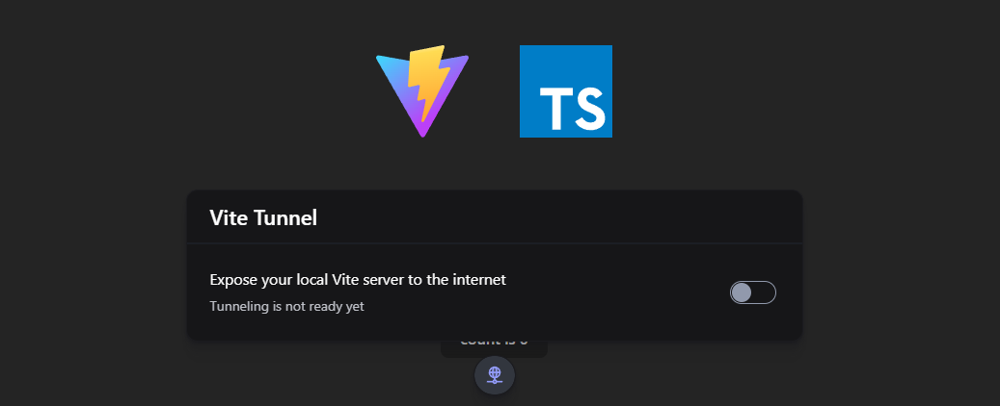

# Vite Tunnel



Vite Tunnel is an Vite plugin that allows you to expose your local Vite server to the internet using [Cloudflare Tunnel](https://developers.cloudflare.com/cloudflare-one/connections/connect-apps).

## Installation

To install Vite Tunnel, run the following command with your preferred package manager:

```sh
npm install -D @vite-libs/tunnel
```

## Usage

```ts
import { defineConfig } from "vite";

import ViteTunnelPlugin from "@vite-libs/tunnel";

// https://vitejs.dev/config/
export default defineConfig({
  plugins: [ViteTunnelPlugin()],
});
```

Upon first starting a tunnel, you will be prompted to accept the terms of the Cloudflare License, Terms and Privacy Policy on the command line. Once you accept these terms, a tunnel will be initiated and a public URL for your local Vite server will be displayed inside the toolbar.

## Configuration

Vite Tunnel accepts the following options:

```ts
ViteTunnelPlugin({
  // The URL to expose. Defaults to {protocol}://{hostname}:{port}.
  url: 'http://localhost:5521',
  // The local server port to expose. Defaults to 5521. (Only used if `url` is not set)
  port: 5521,
  // The local server hostname to expose. Defaults to localhost. (Only used if `url` is not set)
  hostname: "localhost",
  // The local server protocol to use. Defaults to http. (Only used if `url` is not set)
  protocol: "http",
  // Whether to verify the local server TLS certificate. Defaults to false. 
  verifyTLS: false,
  // Whether to accept the Cloudflare terms of service. Defaults to false.
  acceptCloudflareNotice: false,
});
```
